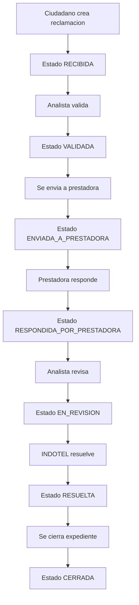
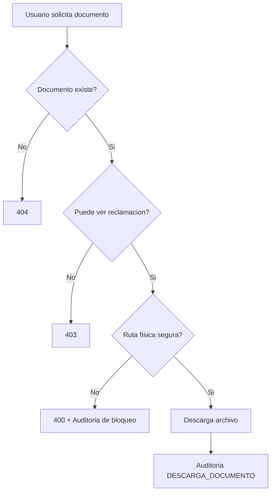
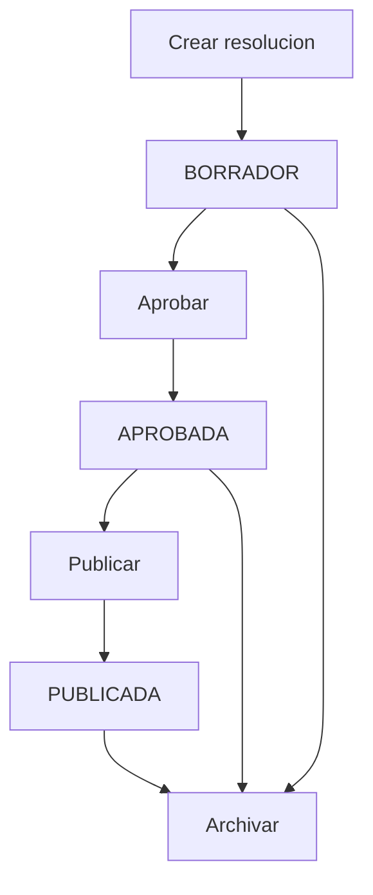
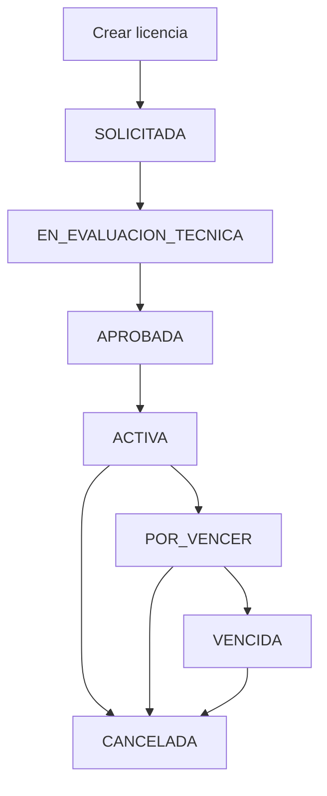

# Arquitectura del Core INDOTEL

Rama: `core`
Proyecto: Sistema Digital INDOTEL
Modulo: `core-indotel/Indotel.Core`

## 1. Proposito del Core

El Core INDOTEL es el backend central del Sistema Digital INDOTEL. Su responsabilidad es procesar la logica principal del dominio regulatorio de telecomunicaciones dentro del alcance academico definido.

Inicialmente el centro del Core era el proceso de reclamaciones. Luego evoluciono con Fase 2 y Fase 3 para incluir resoluciones institucionales, autorizaciones, certificaciones, espectro radioelectrico, licencias tecnicas, reportes regulatorios ampliados y hardening basico de autenticacion.

Este Core no es solamente un CRUD. Implementa reglas de negocio, seguridad, trazabilidad, documentos, SLA, resolucion, cierre, reportes, notificaciones, resoluciones institucionales, autorizaciones, certificaciones, espectro, licencias tecnicas y controles de autenticacion.

## 2. Alcance actual

El Core fue construido como un prototipo institucional avanzado para fines academicos. Esta validado al 100% dentro del alcance funcional definido para la entrega.

No se declara como produccion gubernamental real certificada. Para produccion real aun se requiere hardening adicional de observabilidad, almacenamiento documental externo/cifrado, pruebas automatizadas formales, politicas estrictas por ambiente y revision institucional/legal.

## 3. Estilo arquitectonico actual

El Core actual usa un estilo monolitico modular sobre ASP.NET Core Web API:

```text
Cliente / Swagger / Scripts de prueba
        ↓
Controllers ASP.NET Core
        ↓
Entity Framework Core / Servicios auxiliares
        ↓
SQL Server 2022
```

Capas principales actuales:

```text
Controllers  → Endpoints HTTP y orquestacion de flujos
DTOs         → Contratos de entrada
Models       → Entidades persistidas
Constants    → Estados y reglas simples de transicion
Data         → DbContext y configuracion EF Core
Services     → Reglas auxiliares de estado y SLA
Middleware   → Manejo global de errores
Migrations   → Evolucion de base de datos
Scripts      → Pruebas funcionales end-to-end
Docs         → Evidencia, estado, pruebas y plan productivo
```

## 4. Modulos funcionales del Core

### 4.1 Autenticacion y usuarios

- Login con JWT.
- Registro publico ciudadano.
- Cambio de contrasena autenticado.
- Recuperacion/restablecimiento de contrasena para demo.
- Refresh token.
- Logout real.
- Revocacion de refresh token.
- Bloqueo por intentos fallidos.
- Rate limiting basico en autenticacion.
- Roles principales:
  - Administrador.
  - AnalistaDAU.
  - Auditor.
  - Prestadora.
  - Ciudadano.

### 4.2 Ciudadanos

- Creacion y mantenimiento de ciudadanos.
- Busqueda por cedula.
- Consulta de reclamaciones asociadas.
- Control basico de dueno real.

### 4.3 Prestadoras

- Registro de prestadoras.
- Validacion de RNC duplicado.
- Activacion/desactivacion.
- Consulta de reclamaciones por prestadora.
- Relacion con autorizaciones, certificaciones, frecuencias y licencias tecnicas.

### 4.4 Servicios telecom

- Registro de servicios telecom.
- Validacion de nombre duplicado.
- Activacion/desactivacion.
- Consulta de reclamaciones por servicio.

### 4.5 Motor de reclamaciones

El motor de reclamaciones es el eje principal del Core.

Flujo principal:

```text
RECIBIDA
  ↓
VALIDADA
  ↓
ENVIADA_A_PRESTADORA
  ↓
RESPONDIDA_POR_PRESTADORA
  ↓
EN_REVISION
  ↓
RESUELTA
  ↓
CERRADA
```

Reglas importantes:

- No se permite cerrar una reclamacion sin resolver.
- No se permite saltar estados invalidos.
- Las operaciones criticas generan historial.
- Las operaciones criticas generan auditoria.

### 4.6 Clasificacion

El Core clasifica las reclamaciones usando:

- Tipo de reclamacion.
- Motivo de reclamacion.
- Canal de recepcion.
- Prioridad.
- Provincia.
- Municipio.

Tambien valida la correspondencia entre motivo y tipo de reclamacion.

### 4.7 SLA regulatorio

El Core calcula y administra plazos de respuesta:

- Fecha de envio a prestadora.
- Fecha limite de respuesta.
- Dias habiles SLA.
- Fecha de respuesta de prestadora.
- Estado vencido.
- Marcado automatico/manual de vencidas.

Endpoints principales:

```text
GET /api/reclamaciones/sla/vencidas
POST /api/reclamaciones/sla/marcar-vencidas
```

### 4.8 Resolucion y cierre

El Core diferencia entre resolver y cerrar.

Resolucion:

- ResultadoResolucion.
- ComentarioResolucion.
- FundamentoResolucion.
- AccionOrdenada.
- MontoAjuste.
- UsuarioResolucionId.
- FechaResolucion.

Cierre:

- MotivoCierre.
- ComentarioCierre.
- ConformidadCiudadano.
- UsuarioCierreId.
- FechaCierre.

### 4.9 Documentos seguros

El Core permite:

- Subir documentos.
- Listar documentos.
- Descargar documentos.
- Bloquear descargas a ciudadanos ajenos.
- Bloquear subida de documentos en casos finales.
- Auditar subida, descarga y eliminacion.

Endpoints principales:

```text
GET /api/reclamaciones/{id}/documentos
POST /api/reclamaciones/{id}/documentos
GET /api/documentos/{id}/descargar
DELETE /api/documentos/{id}
```

### 4.10 Auditoria institucional

La auditoria registra eventos institucionales manuales y automaticos.

Campos principales:

```text
UsuarioId
UsuarioCorreo
UsuarioRol
Entidad
EntidadId
Accion
Nivel
Detalle
EstadoAnterior
EstadoNuevo
MetodoHttp
Ruta
DireccionIp
UserAgent
CorrelationId
Fecha
```

Acciones auditadas automaticamente incluyen:

```text
CREAR_RECLAMACION
CAMBIO_ESTADO
RESPUESTA_PRESTADORA
SLA_VENCIDA
RESOLVER_RECLAMACION
CERRAR_RECLAMACION
SUBIR_DOCUMENTO
DESCARGA_DOCUMENTO
ELIMINAR_DOCUMENTO
CREAR_RESOLUCION_INSTITUCIONAL
APROBAR_RESOLUCION_INSTITUCIONAL
PUBLICAR_RESOLUCION_INSTITUCIONAL
ADJUNTAR_DOCUMENTO_RESOLUCION
CREAR_SOLICITUD_AUTORIZACION
CAMBIO_ESTADO_AUTORIZACION
RENOVAR_AUTORIZACION
CREAR_SOLICITUD_CERTIFICACION
CAMBIO_ESTADO_CERTIFICACION
CREAR_FRECUENCIA
ASIGNAR_FRECUENCIA
CREAR_LICENCIA_TECNICA
CAMBIO_ESTADO_LICENCIA_TECNICA
```

### 4.11 Resoluciones institucionales

Modulo de Fase 2A.

Permite:

- Crear resoluciones institucionales.
- Aprobar resoluciones.
- Publicar resoluciones.
- Archivar resoluciones.
- Adjuntar documento oficial por URL o documento vinculado.
- Bloquear publicacion sin aprobacion previa.
- Consultar reportes de resoluciones.
- Auditar acciones sensibles.

Flujo:

```text
BORRADOR -> APROBADA -> PUBLICADA -> ARCHIVADA
BORRADOR -> ARCHIVADA
APROBADA -> ARCHIVADA
```

### 4.12 Autorizaciones y certificaciones

Modulo de Fase 2B.

Permite:

- Crear solicitudes de autorizacion.
- Crear solicitudes de certificacion.
- Pasar solicitudes a revision.
- Aprobar solicitudes.
- Rechazar solicitudes.
- Renovar solicitudes aprobadas o vencidas.
- Consultar reportes por estado.
- Auditar creacion, cambio de estado y renovacion.

Estados:

```text
RECIBIDA
EN_REVISION
DOCUMENTACION_INCOMPLETA
APROBADA
RECHAZADA
VENCIDA
RENOVADA
```

### 4.13 Espectro radioelectrico y licencias tecnicas

Modulo de Fase 2C.

Permite:

- Registrar frecuencias radioelectricas.
- Consultar frecuencias.
- Asignar frecuencias.
- Bloquear asignaciones duplicadas.
- Crear licencias tecnicas.
- Mover licencias por estados tecnicos.
- Cancelar licencias.
- Consultar reportes de espectro y licencias.
- Auditar acciones tecnicas.

Estados de frecuencia:

```text
DISPONIBLE
ASIGNADA
RESERVADA
SUSPENDIDA
```

Estados de licencia:

```text
SOLICITADA
EN_EVALUACION_TECNICA
APROBADA
ACTIVA
POR_VENCER
VENCIDA
CANCELADA
```

### 4.14 Busqueda y reportes

Busqueda paginada:

```text
GET /api/reclamaciones/buscar
```

Filtros:

```text
numeroExpediente
estado
ciudadanoId
prestadoraId
servicioTelecomId
tipoReclamacionId
motivoReclamacionId
prioridad
canalRecepcion
provincia
municipio
desde
hasta
vencida
page
pageSize
```

Reportes base:

```text
GET /api/reportes/resumen
GET /api/reportes/reclamaciones-por-estado
GET /api/reportes/reclamaciones-por-prestadora
GET /api/reportes/reclamaciones-por-servicio
GET /api/reportes/reclamaciones-por-provincia
GET /api/reportes/reclamaciones-por-tipo
GET /api/reportes/sla
GET /api/reportes/productividad
```

Reportes Fase 2:

```text
GET /api/reportes/resoluciones
GET /api/reportes/autorizaciones
GET /api/reportes/certificaciones
GET /api/reportes/espectro
GET /api/reportes/licencias-tecnicas
```

Reportes Fase 2D:

```text
GET /api/reportes/prestadoras-ranking
GET /api/reportes/sla-ranking
GET /api/reportes/reclamaciones-mensual
GET /api/reportes/tiempo-promedio-respuesta
GET /api/reportes/servicios-mas-reclamados
GET /api/reportes/resoluciones-periodo
GET /api/reportes/autorizaciones-estado
GET /api/reportes/certificaciones-estado
GET /api/reportes/licencias-vencimiento
```

### 4.15 Notificaciones internas

El Core maneja notificaciones internas para usuarios, ciudadanos y prestadoras.

Endpoints:

```text
GET /api/notificaciones
GET /api/notificaciones/{id}
POST /api/notificaciones
PATCH /api/notificaciones/{id}/leer
PATCH /api/notificaciones/{id}/enviar
```

Incluye control de dueno real: un ciudadano no puede leer ni marcar como leida la notificacion de otro ciudadano.

### 4.16 Health checks y manejo de errores

Endpoints:

```text
GET /api/health
GET /api/health/db
GET /health
```

El middleware global de errores devuelve:

```text
mensaje
codigo
correlationId
fecha
```

## 5. Flujo de una reclamacion



## 6. Flujo de seguridad documental



## 7. Flujo de resolucion institucional



## 8. Flujo de licencia tecnica



## 9. Por que no es solo CRUD

Un CRUD simple crea, lee, actualiza y elimina datos.

Este Core agrega reglas institucionales:

- Maquina de estados con transiciones bloqueadas.
- SLA regulatorio.
- Auditoria institucional.
- Seguridad por roles.
- Proteccion por dueno real.
- Documentos seguros.
- Resolucion y cierre estructurado.
- Resoluciones institucionales con aprobacion/publicacion.
- Autorizaciones y certificaciones con estados y renovacion.
- Gestion tecnica de espectro y licencias.
- Reportes regulatorios base y ampliados.
- Notificaciones internas.
- Refresh token, logout, bloqueo por intentos fallidos y rate limiting.
- Pruebas funcionales end-to-end.

## 10. Evolucion recomendada

Para una version productiva futura se recomienda evolucionar a una arquitectura mas separada:

```text
API
Application
Domain
Infrastructure
Tests
```

Separacion futura:

```text
Controllers -> Services -> Repositories -> DbContext
DTOs -> Validators -> Domain Rules
```

Tambien se recomienda:

```text
xUnit para pruebas automatizadas.
Logs estructurados.
Observabilidad.
Almacenamiento documental externo o cifrado.
Politicas CORS estrictas por ambiente.
Validadores formales de DTOs.
Revision legal/institucional.
```

Esta evolucion no es necesaria para la defensa actual, pero es el siguiente paso natural para mantenimiento a largo plazo.
